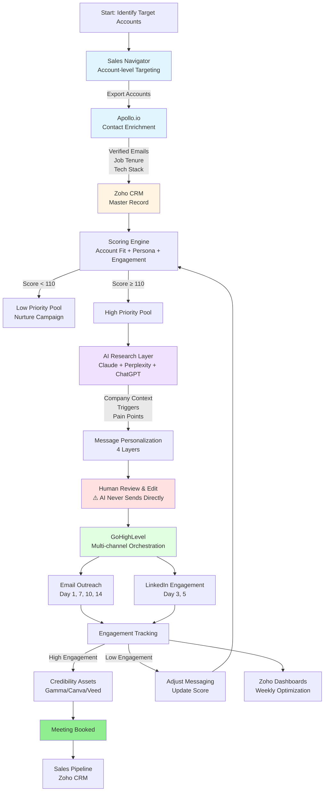
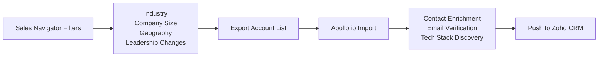
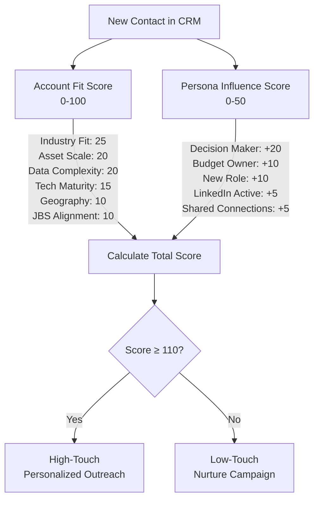
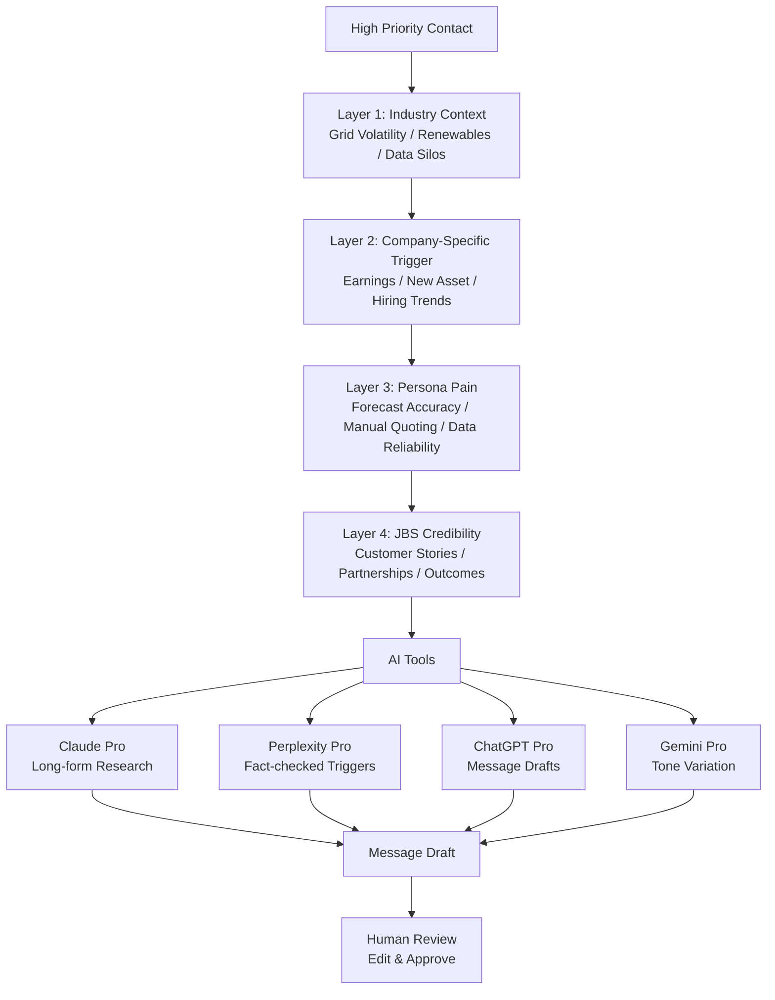
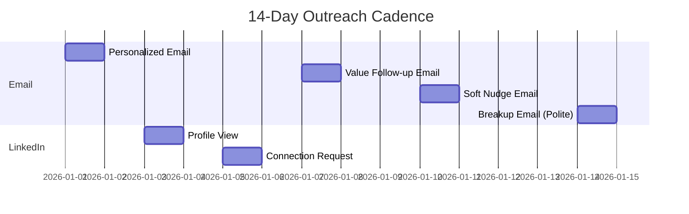
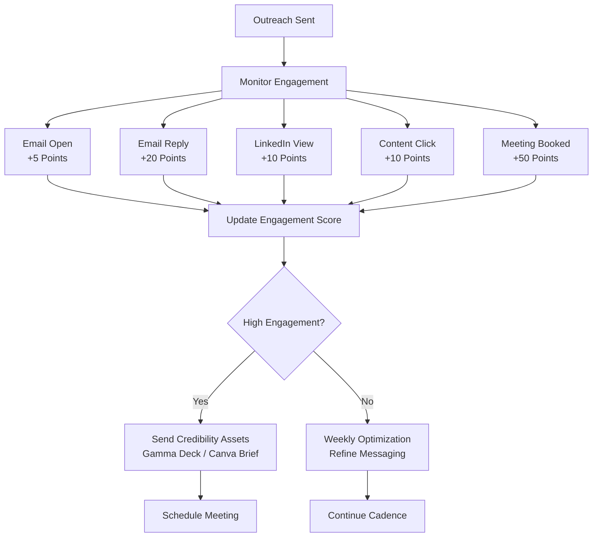
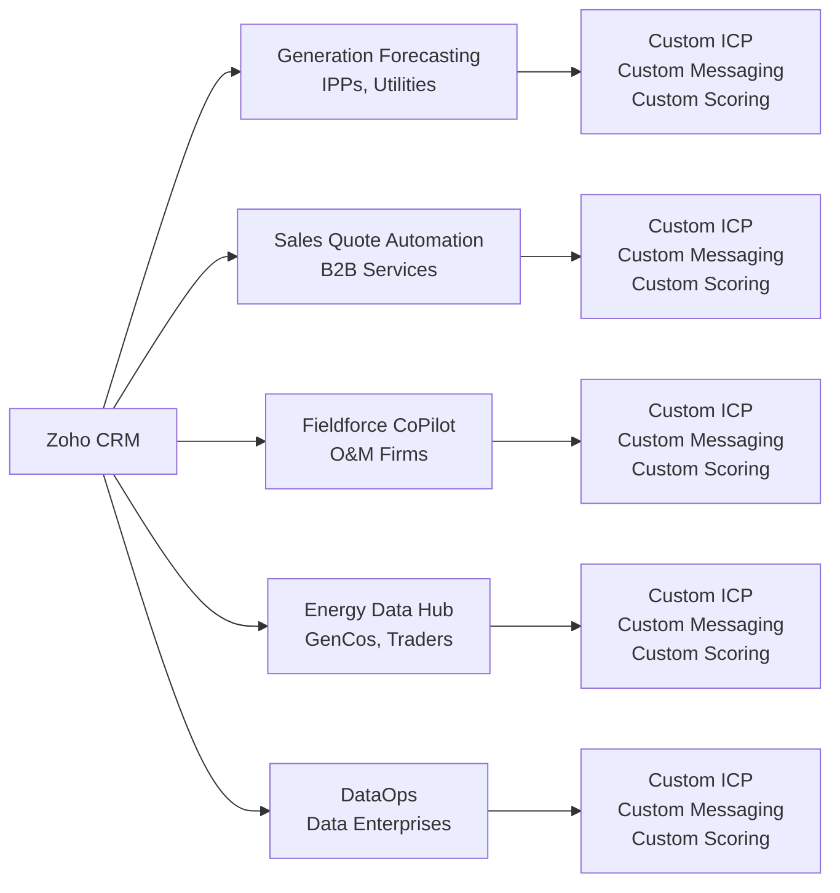
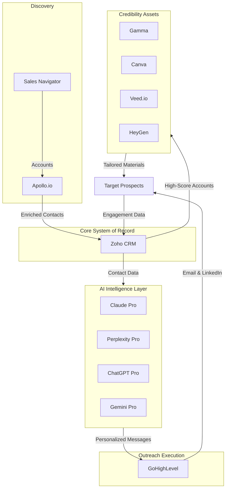

# B2B Outreach System Workflow Diagram

## Overall System Architecture

## Detailed Process Flow by Stage

### Stage 1: Prospect Discovery

### Stage 2: Scoring & Prioritization

### Stage 3: AI Research & Personalization

### Stage 4: Outreach Execution (14-Day Cadence)

### Stage 5: Engagement Tracking & Optimization

## Hero Bet Segmentation

## System Integration Map

---

## Key Principles

1. **Human in the Loop**: AI generates inputs, not outputs. Humans review and approve all messages.
2. **Precision over Volume**: Target high-fit accounts with personalized messaging.
3. **Multi-layer Personalization**: Industry context + company triggers + persona pain + JBS credibility.
4. **Continuous Optimization**: Weekly analysis of what's working, kill low-performers, double down on high-performers.
5. **Hero Bet Segmentation**: Each of the 5 JBS hero bets gets its own ICP, messaging, and cadence.

---

*This workflow diagram is based on the B2B Outreach System defined in Outreach.md*
